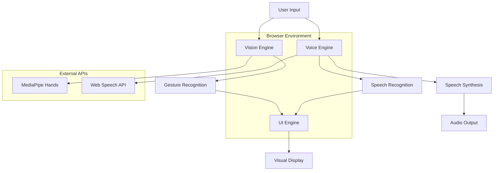

# Design Document: Silent-Connect

## Overview

Silent-Connect is a real-time, browser-based communication tool that bridges the gap between deaf/hard-of-hearing and hearing individuals. The system operates entirely client-side using modern web technologies: MediaPipe for gesture recognition, Web Speech API for voice processing, and React with Vite for the user interface.

The architecture follows a modular approach with three core engines: Vision Engine (gesture recognition), Voice Engine (speech processing), and UI Engine (user interface). All processing occurs locally in the browser, ensuring privacy and eliminating network latency.

## Architecture

### High-Level Architecture



### Component Architecture

The system is organized into three primary layers:

1. **Presentation Layer**: React components handling user interface and visual feedback
2. **Business Logic Layer**: Custom hooks managing gesture recognition and speech processing
3. **Integration Layer**: MediaPipe and Web Speech API integrations

### Technology Stack

- **Frontend Framework**: React 18 with Vite
- **Styling**: Tailwind CSS with custom cyber-accessibility theme
- **Gesture Recognition**: @mediapipe/hands, @mediapipe/drawing_utils
- **Video Capture**: react-webcam
- **Speech Processing**: Web Speech API (native browser)
- **State Management**: React hooks (useState, useEffect, useRef)

## Components and Interfaces

### Core Components

#### 1. App Component
- **Purpose**: Root component orchestrating the entire application
- **Responsibilities**: Layout management, theme application, global state coordination
- **Props**: None
- **State**: Application-level configuration and theme settings

#### 2. VideoFeed Component
- **Purpose**: Manages camera input and displays video with gesture overlays
- **Responsibilities**: Video capture, MediaPipe integration, visual feedback rendering
- **Props**: `onGestureDetected: (gesture: string, confidence: number) => void`
- **State**: Camera status, current gesture, confidence level

#### 3. ConversationLog Component
- **Purpose**: Displays communication history in chat bubble format
- **Responsibilities**: Message rendering, scroll management, accessibility features
- **Props**: `messages: Message[]`
- **State**: Message list, scroll position

#### 4. VoiceControls Component
- **Purpose**: Handles speech-to-text and microphone controls
- **Responsibilities**: Speech recognition, microphone state, text display
- **Props**: `onSpeechDetected: (text: string) => void`
- **State**: Listening status, recognized text, microphone permissions

#### 5. ConfidenceMeter Component
- **Purpose**: Visual indicator for gesture recognition accuracy
- **Responsibilities**: Confidence display, visual feedback for recognition quality
- **Props**: `confidence: number, gesture: string`
- **State**: Animation state, display visibility

### Custom Hooks

#### useHandTracking Hook
```typescript
interface HandTrackingResult {
  isLoaded: boolean;
  currentGesture: string | null;
  confidence: number;
  landmarks: HandLandmark[] | null;
  error: string | null;
}

const useHandTracking = (
  videoRef: RefObject<HTMLVideoElement>,
  canvasRef: RefObject<HTMLCanvasElement>
): HandTrackingResult
```

**Responsibilities**:
- Initialize MediaPipe Hands model
- Process video frames for hand detection
- Calculate gesture recognition from landmarks
- Provide real-time feedback

#### useSpeechRecognition Hook
```typescript
interface SpeechRecognitionResult {
  isListening: boolean;
  transcript: string;
  startListening: () => void;
  stopListening: () => void;
  error: string | null;
}

const useSpeechRecognition = (): SpeechRecognitionResult
```

**Responsibilities**:
- Manage Web Speech API integration
- Handle speech recognition lifecycle
- Provide transcript updates
- Error handling and recovery

#### useSpeechSynthesis Hook
```typescript
interface SpeechSynthesisResult {
  speak: (text: string) => void;
  isSpeaking: boolean;
  cancel: () => void;
  error: string | null;
}

const useSpeechSynthesis = (): SpeechSynthesisResult
```

**Responsibilities**:
- Manage text-to-speech functionality
- Handle speech synthesis queue
- Provide speaking status
- Error handling and recovery

### Gesture Recognition System

#### GestureRecognizer Class
```typescript
class GestureRecognizer {
  private landmarks: HandLandmark[] | null = null;
  
  detectGesture(landmarks: HandLandmark[]): GestureResult {
    // Geometric analysis of hand landmarks
    // Returns gesture type and confidence
  }
  
  private isOpenPalm(landmarks: HandLandmark[]): boolean
  private isClosedFist(landmarks: HandLandmark[]): boolean
  private isThumbsDown(landmarks: HandLandmark[]): boolean
  private isPeaceSign(landmarks: HandLandmark[]): boolean
  private isPointingUp(landmarks: HandLandmark[]): boolean
}
```

**Gesture Detection Logic**:
- **Open Palm**: All fingertips above their respective PIP joints, fingers spread
- **Closed Fist**: All fingertips below their respective PIP joints
- **Thumbs Down**: Thumb tip below thumb IP joint, other fingers curled
- **Peace Sign**: Index and middle fingertips above PIP joints, others curled
- **Pointing Up**: Only index fingertip above PIP joint, others curled

## Data Models

### Message Interface
```typescript
interface Message {
  id: string;
  type: 'gesture' | 'speech';
  content: string;
  timestamp: Date;
  confidence?: number;
  sender: 'user' | 'system';
}
```

### GestureResult Interface
```typescript
interface GestureResult {
  gesture: string;
  confidence: number;
  landmarks: HandLandmark[];
  timestamp: Date;
}
```

### HandLandmark Interface (MediaPipe)
```typescript
interface HandLandmark {
  x: number;
  y: number;
  z: number;
  visibility?: number;
}
```

### AppState Interface
```typescript
interface AppState {
  isVideoActive: boolean;
  isListening: boolean;
  currentGesture: string | null;
  confidence: number;
  messages: Message[];
  error: string | null;
}
```

## Correctness Properties

*A property is a characteristic or behavior that should hold true across all valid executions of a system-essentially, a formal statement about what the system should do. Properties serve as the bridge between human-readable specifications and machine-verifiable correctness guarantees.*

Let me analyze the acceptance criteria for testability:

<function_calls>
<invoke name="prework">
<parameter name="featureName">silent-connect

## Correctness Properties

*A property is a characteristic or behavior that should hold true across all valid executions of a system-essentially, a formal statement about what the system should do. Properties serve as the bridge between human-readable specifications and machine-verifiable correctness guarantees.*

Based on the prework analysis, here are the testable correctness properties:

### Property 1: Hand Landmark Processing
*For any* valid hand landmark data, the system should successfully process and track the landmarks in real-time without errors.
**Validates: Requirements 1.2**

### Property 2: Gesture Hold Duration Triggers Speech
*For any* recognized gesture held for 1.5 seconds or longer, the system should trigger the corresponding text-to-speech output exactly once.
**Validates: Requirements 1.3, 4.1**

### Property 3: Visual Feedback Consistency
*For any* detected hand landmarks, the system should display green skeleton connectors on the video feed.
**Validates: Requirements 1.4, 5.1**

### Property 4: Speech Text Display Formatting
*For any* text generated from speech recognition, the system should display it with large, high-contrast formatting in subtitle mode.
**Validates: Requirements 3.3, 3.5**

### Property 5: Confidence Threshold Enforcement
*For any* gesture recognition with confidence below 70%, the system should not trigger speech output.
**Validates: Requirements 5.3**

### Property 6: Gesture Recognition Display
*For any* recognized gesture, the confidence meter should display the recognition percentage.
**Validates: Requirements 5.2**

### Property 7: Speech Synthesis Visual Feedback
*For any* active speech synthesis, the system should provide visual feedback indicators.
**Validates: Requirements 4.4**

### Property 8: Anti-Glitch Protection
*For any* rapid sequence of gesture changes (faster than 1.5 seconds), the system should prevent multiple speech outputs from triggering.
**Validates: Requirements 4.3**

### Property 9: Error Handling Resilience
*For any* speech synthesis error condition, the system should handle it gracefully without crashing.
**Validates: Requirements 4.5**

### Property 10: Message Display Formatting
*For any* communication message, the conversation log should display it in chat bubble style.
**Validates: Requirements 6.4**

### Property 11: Local Processing Guarantee
*For any* system operation, no external network requests should be made during processing.
**Validates: Requirements 7.4, 8.2**

## Error Handling

### Gesture Recognition Errors
- **Camera Access Denied**: Display user-friendly message with instructions to enable camera permissions
- **MediaPipe Model Loading Failed**: Provide fallback message and retry mechanism
- **Low Confidence Recognition**: Visual feedback indicating poor gesture quality, no speech output
- **No Hands Detected**: Clear visual indicator showing system is ready for input

### Speech Processing Errors
- **Microphone Access Denied**: Clear instructions for enabling microphone permissions
- **Speech Recognition Unavailable**: Fallback to manual text input mode
- **Speech Synthesis Failed**: Silent failure with visual error indicator
- **Browser Compatibility**: Graceful degradation with feature availability notifications

### Performance Degradation
- **Low Frame Rate**: Automatic quality adjustment to maintain responsiveness
- **High CPU Usage**: Throttling mechanisms to prevent browser freezing
- **Memory Leaks**: Proper cleanup of MediaPipe resources and event listeners

## Testing Strategy

### Dual Testing Approach
The testing strategy employs both unit tests and property-based tests to ensure comprehensive coverage:

- **Unit Tests**: Verify specific examples, edge cases, and error conditions
- **Property Tests**: Verify universal properties across all inputs using randomized testing
- **Integration Tests**: Validate component interactions and end-to-end workflows

### Property-Based Testing Configuration
- **Testing Library**: fast-check for JavaScript property-based testing
- **Minimum Iterations**: 100 iterations per property test
- **Test Tagging**: Each property test tagged with format: **Feature: silent-connect, Property {number}: {property_text}**

### Unit Testing Focus Areas
- Gesture recognition algorithm accuracy with known hand landmark patterns
- Speech synthesis integration with Web Speech API
- UI component rendering with various input states
- Error handling scenarios and edge cases
- Browser API integration points

### Testing Environment
- **Primary Browser**: Chrome (best MediaPipe support)
- **Secondary Browsers**: Edge, Firefox for compatibility testing
- **Mock Data**: Synthetic hand landmark data for consistent testing
- **Performance Testing**: Frame rate and latency measurements in development mode

### Continuous Integration
- Automated test execution on code changes
- Performance regression detection
- Browser compatibility validation
- Accessibility compliance verification